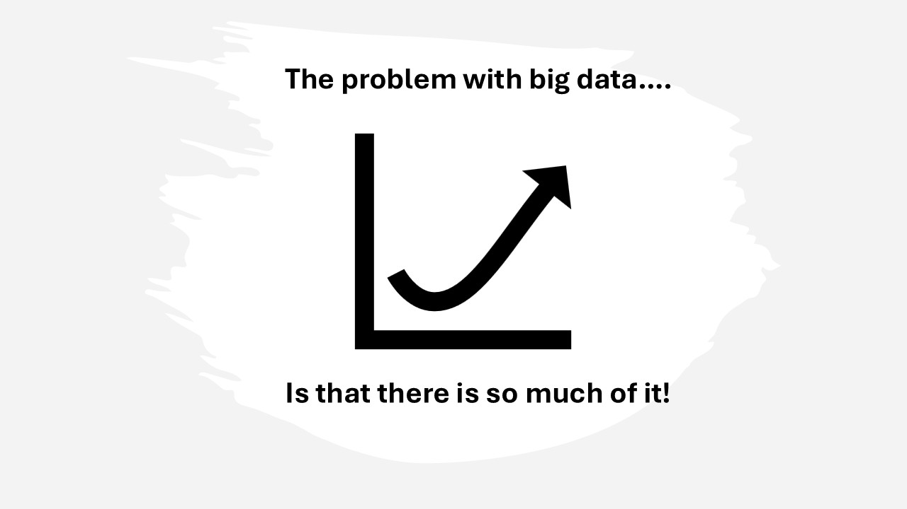

# St. Joseph River Basin Web Map Intro

author
:    Kate Barrett, PhD
institution
:    Holy Cross College @ Notre Dame

# Purpose of the St. Joseph River Basin Web Map

* https://data.sjrbc.com/

# Goals of this talk

* introduce map layout
* variable display
* site selection
* graphing tool

# Disclaimer

* not all data included
* nature of big data

# Map Landing Page

* Boundaries
* Data points
* tool tips

# Change Variable View

# View Site Data

# Graph Site Data

# Return to main landing page

# Thank you & questions!

* contact: thewaterlistener@gmail.com

